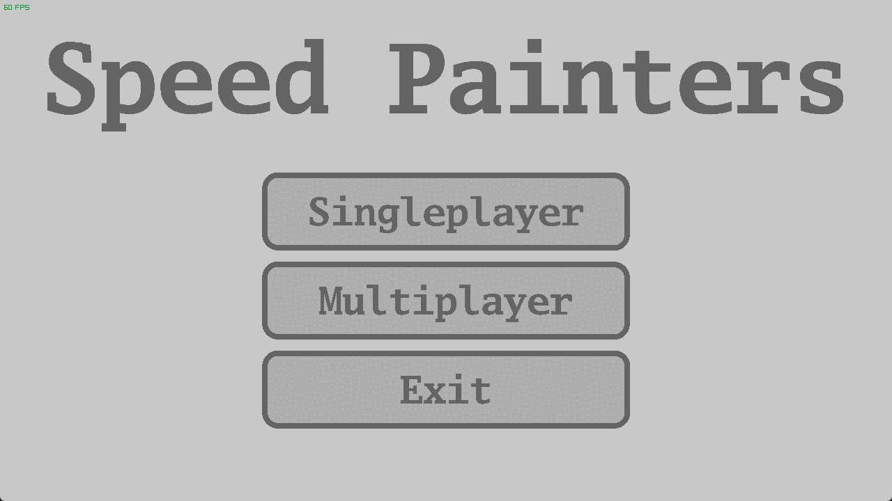
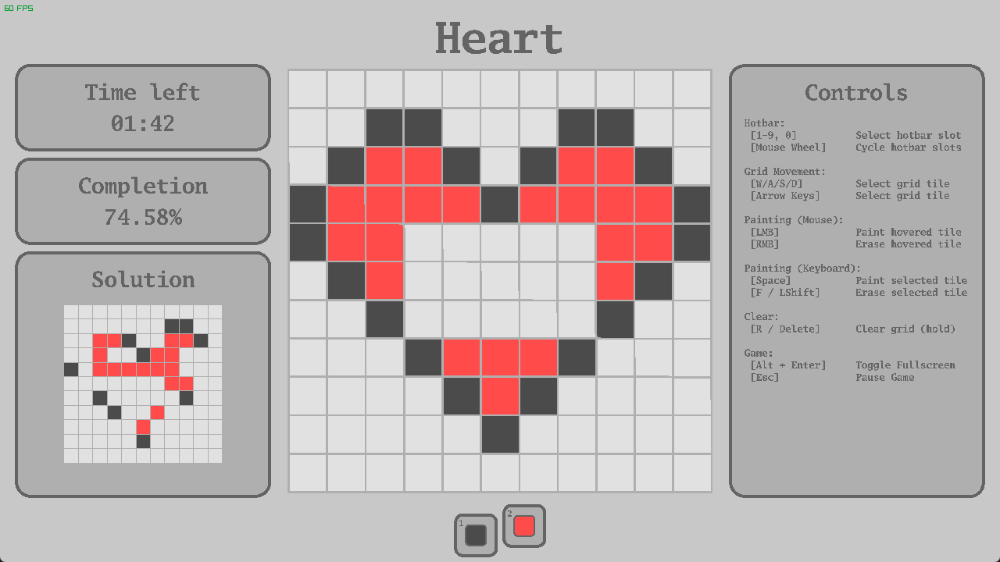

# SpeedPainters (C & raylib)

Simple pixel art memory game written in C using the raylib library.

---
## Gameplay
- You are shown a pixel art image for 5 seconds
- You must recreate it from memory within the given time
- Your result is evaluated based on how closely it matches the original




---
## Features
- Full mouse controls
- Full keyboard controls
- Singleplayer mode
- Multiplayer mode (TO DO!)

---
## Building
### Requirements
- C Compiler with C 23 support (GCC, Clang, MSVC)
- CMake (3.16 or newer)
- No manual raylib installation should be required (auto-fetched if missing)

### Build steps
```
git clone git@github.com:genlosha/SpeedPainters.git 
cd SpeedPainters 
cmake -S . -B ./build
cmake --build ./build
```

### Binaries
Binaries for Windows available under releases.